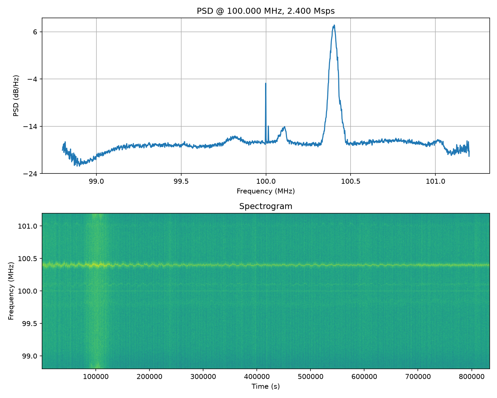

This receives IQ data streamed from an RT-SDR dongle over TCP (using rtl-tcp) and plots a PSD and Spectrograph. You should run this from the sample PC as the USB dongle.

 - `Fc=100MHz` 
 - `Fs=2.4GHz`

