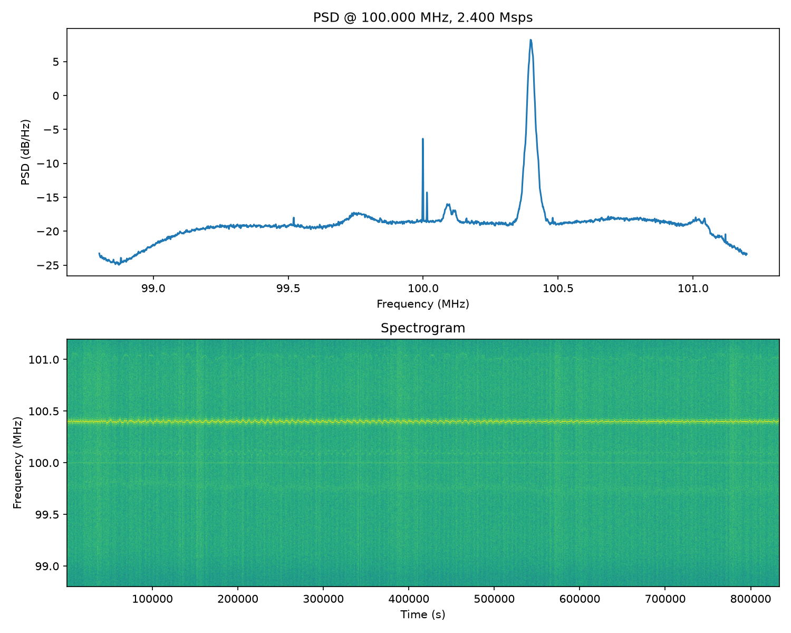
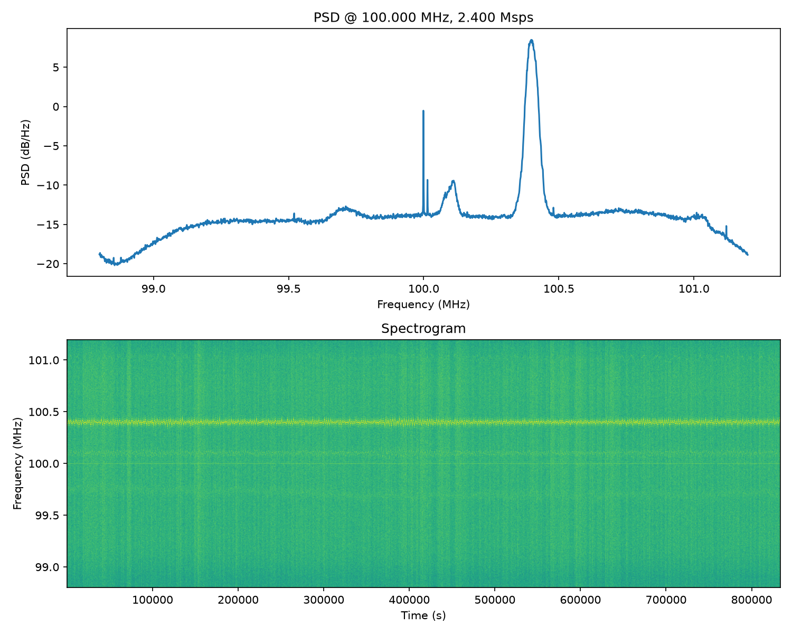
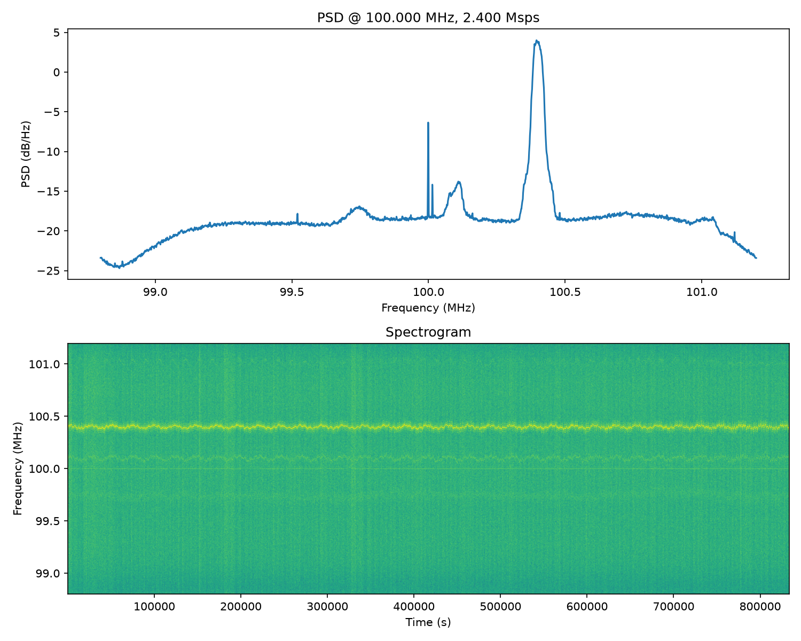
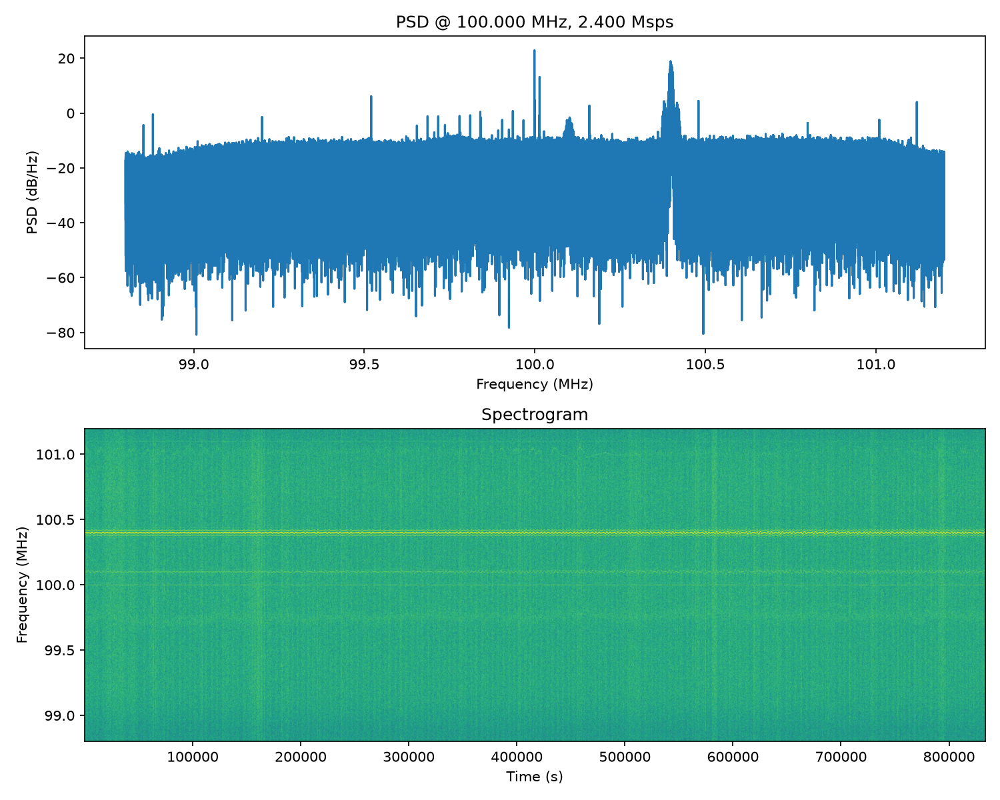
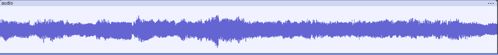

This receives IQ data streamed from an RT-SDR dongle over TCP (using rtl-tcp) and plots a PSD and Spectrograph. Implemented in both python and C++. FFT is calculated using Numpy and KissFFT respectively.

 - `Fc=100MHz` 
 - `Fs=2.4GHz`



## Quickstart

1. Clone this repo to both the server (the machine with the RTL SDR USB dongle) and client (can be the same machine)
1. Install `rtl-sdr`  on the server:

    ```
    sudo apt update
    sudo apt install rtl-sdr librtlsdr-dev
    ```

1. Disable the default DVB USB dongle driver:

    ```
    echo 'blacklist dvb_usb_rtl28xxu' | sudo tee /etc/modprobe.d/blacklist-dvb_usb_rtl28xxu.conf
    ```

1. Run `scripts/restart_rtl_server.sh` on the server. Check for errors.
1. Run one of the examples on the client.

NOTE: You can stop the RTL server with `kill $(pgrep -a rtl_tcp)`

----

# Analysis

## Spectral Leakage

Post processing of the FFT bins with a hann window will improve the clarity of the PSD plot. Without the window each bin's sinc-shaped response has slowly-decaying sidelobs, so energy from a strong signal smears into neighbouring bins. Multiplying each bin with the window increases the side-lobe decay which allows the the true shape of the spectrum to come through more clearly. _You may need to zoom into see the difference_.

|Without Hann Window|With Hann Window|
|-|-|
|||

## Noise Floor

A standard periodogram provides an inconsistent estimate with high variance, making the resulting spectrum look jagged and noisy. We use Welch's method to reduce the random "noise" and variance inherent in standard periodograms by

- Splitting the signal into overlapping N-sample segments (50% overlap)
- Calculate the average power spectra for each bin across the whole FFT range.

More segments equals less noisy noise floor, at the cost of frequency resolution (bin width becomes sampleRate/N instead of sampleRate/n).

Note: `--nfft N` enables Welch's method.

|Without Welch's Method|With Welch's Method|
|-|-|
|||

---

# FM Demodulation

1. Receive the IQ samples from the RTL SDR at an offset so to avoid the SDR's DC spike.
2. Mix it down to baseband to remove the offset.
3. Use a low-pass filter to isolate the FM channel and reject everything else
4. Decimate down to a sane rate for demodulation
5. FM demodulate
6. Resample from the demod rate down to a standard audio rate
7. Save as raw float32 PCM so it can be played back

